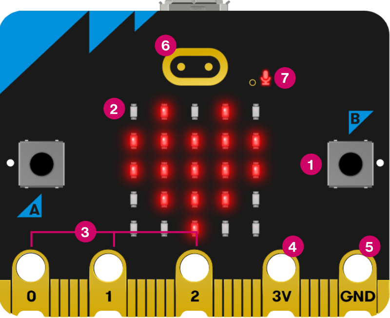
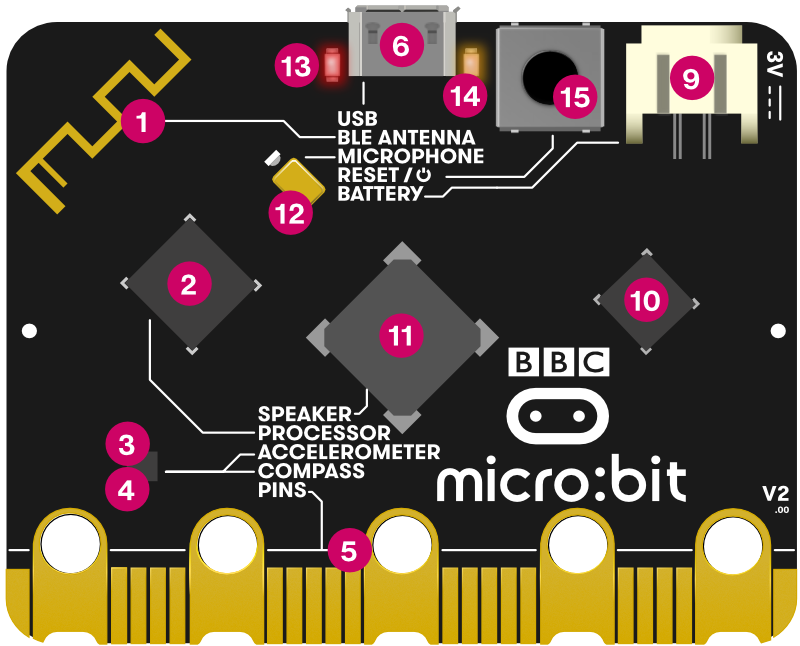

```{=html}
<style>
.cr-section .sticky img {
  background-color: white;
  border-radius: 12px;
  padding: 18px;
  filter: brightness(1.25) contrast(1.05);
}
</style>
```

:::{.cr-section}

::: {#cr-front}
{width=75% fig-align="center"}
:::

**The BBC micro:bit V2 — front** \
Scroll down to explore the main components. [@cr-front]{scale-by="1"}

This is the complete front of the board — roughly the size of a credit card. The numbered labels identify each feature. We will work through them one by one. [@cr-front]{scale-by="1"}

The **5×5 LED matrix** is the most visible feature on the front. 25 individually controllable red LEDs can display scrolling text, numbers, arrows, and custom images. The matrix also works as a **light sensor** — it can detect ambient brightness without any extra components. [@cr-front]{scale-by="1.4"}

**Button A** is on the left side of the board. In MakeCode, pressing it triggers an `on button A pressed` event. You can programme any action in response — displaying a reading, toggling a light, or sending a radio message. [@cr-front]{pan-to="38%" scale-by="2"}

**Button B** mirrors Button A on the right. You can programme A and B independently, or detect when **both are pressed together** for a third action. [@cr-front]{pan-to="-38%" scale-by="2"}

The **gold touch logo** at the top is a capacitive touch sensor — unique to the V2. Your finger doesn't need to press it: just touching it is enough. [@cr-front]{pan-to="0%,30%" scale-by="2"}

The small dot to the right of the logo is the **microphone activity LED**. It lights up whenever the built-in microphone is recording — a privacy indicator so you always know when sound is being measured. [@cr-front]{pan-to="-35%,30%" scale-by="2"}

The gold band along the bottom is the **edge connector**. The three large holes — labelled **0**, **1**, and **2** — are general-purpose input/output pins: connect sensors here with crocodile clips or the Sensorbit. **3V** supplies power to connected components; **GND** completes the circuit. [@cr-front]{pan-to="0%,-20%" scale-by="1.5"}

That covers the front. Now let's flip it over. [@cr-front]{scale-by="1"}

::: {#cr-back}
{width=75% fig-align="center"}
:::

**The BBC micro:bit V2 — back** \
Most of the processing and sensing happens here. [@cr-back]{scale-by="1"}

Here is the full back of the board. The large chips, the antenna trace, and the connectors are all visible. We will go through each in turn. [@cr-back]{scale-by="1"}

The gold zig-zag trace in the top left is the **Bluetooth and radio antenna** — printed directly onto the board, no separate component needed. It handles both Bluetooth Low Energy (for phone connectivity) and the micro:bit's own 2.4 GHz radio protocol (for micro:bit-to-micro:bit communication). [@cr-back]{pan-to="38%,45%" scale-by="2.3"}

The **micro USB port** at the top centre is how you connect the micro:bit to your laptop to download programmes. It also powers the board from USB. When you drag a `.hex` file onto the MICROBIT drive, it enters through this port. [@cr-back]{pan-to="0%,25%" scale-by="1.8"}

The square component in the centre is the **speaker**. It can play tones, melodies, and sound effects directly, with no extra wiring. In MakeCode, use the `Music` category. [@cr-back]{pan-to="0%,0%" scale-by="2"}

The small component close to the speaker is the backside of the **microphone** — on the front you will see it as a little hole. It detects sound level and can recognise loud events such as claps or shouts. The LED you saw on the front indicates when it is active. [@cr-back]{pan-to="13%,33%" scale-by="2.4"}

The **battery connector** on the right edge accepts a standard 2× AAA battery pack. This is how you power the micro:bit away from a laptop — essential for portable projects and demos. [@cr-back]{pan-to="-43%,38%" scale-by="2.3"}

The chip left of the speaker is the **processor** — a Nordic nRF52833 running at 64 MHz with 512 KB of flash memory. Your programme lives here. It also contains a built-in **temperature sensor** that measures the chip temperature — a rough proxy for air temperature. [@cr-back]{pan-to="37%,14%" scale-by="2.6"}

The two diamond-shaped chips on the left are the **accelerometer** and **compass**. The accelerometer measures forces in three dimensions — tilt, shake, freefall, movement. The compass detects magnetic north. Both are available as built-in sensor blocks in MakeCode, no extra wiring needed. [@cr-back]{pan-to="26%,-13%" scale-by="1.6"}

That is the complete micro:bit V2. Front and back, you now know what every component does. [@cr-back]{scale-by="1"}

:::
