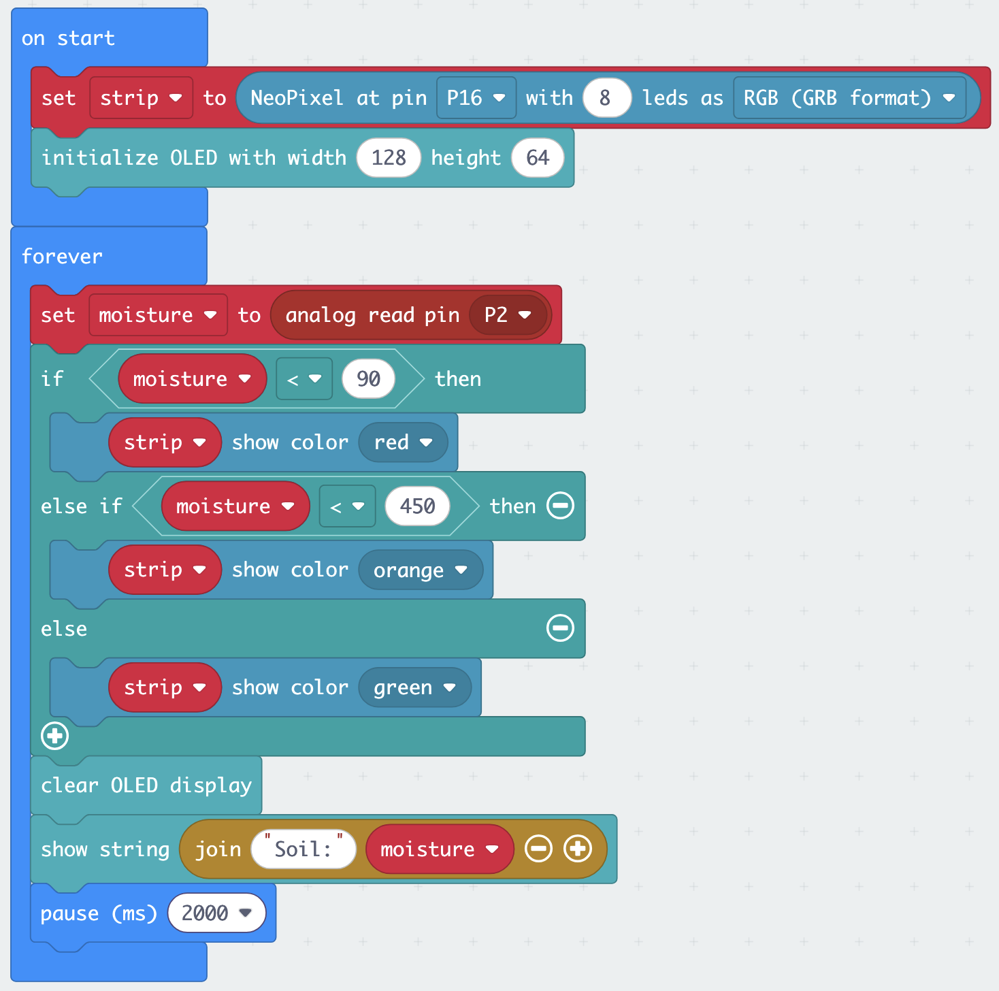

::: {.callout-note}
**16 June, 14:00–16:00** · You will work in your team of 4–5 throughout. You have one micro:bit and one Smart Health Kit per team. Take turns at the keyboard — every team member should understand each step before you move on.
:::

---

## What you will build

Four core exercises, building in complexity — each one introduces one new cluster of ideas and rehearses everything before it. Two optional exercises for teams that move fast.

| | Exercise | Sensor | Output | Context |
|-|----------|--------|--------|---------|
| 1 | Push the button | Built-in (buttons, temperature) | LED matrix | Your first complete device |
| 2 | Emergency call button | Crash sensor | LED matrix + sound | Patient bed call button |
| 3 | Environmental monitor | DHT11 (temp + humidity) | OLED display | Vaccine cold-chain monitoring |
| 4 | Irrigation alarm | Soil moisture | Rainbow LED | Automated plant watering |
| 5 | *(Optional)* Motion-triggered alert | PIR | LED matrix + OLED + sound | Clinic entry detection |
| 6 | *(Optional)* Sanitiser-use detector | MQ3 alcohol | OLED + LED matrix | Hand-hygiene monitoring |
| ★ | Mini challenge | Your choice | Your choice | Your application |

---

## Learning objectives

By the end of this lab you will be able to:

- Use **event blocks** (`on button A pressed`) and the **`forever` loop**, and explain when each is the right tool
- Connect a sensor to the micro:bit using the Sensorbit (G to G, V to V, S to S)
- Read digital and analog sensor values in MakeCode and store them in variables
- Display a reading on the OLED screen
- Use `if / else if / else` to make decisions based on a sensor value
- Drive an output — display, sound, LED strip — in response to a sensor
- Describe at least one limitation you personally observed

---

## Team roles

With 4–5 people sharing one device, assign roles at the start of each exercise and rotate them.

| Role | What they do |
|------|-------------|
| **Driver** | Operates the keyboard in MakeCode |
| **Navigator** | Reads the instructions aloud and tells the driver what to do |
| **Hardware lead** | Connects and handles sensors and cables |
| **Checker** | Watches the device output and spots when something is wrong |
| **Documenter** | Notes down observed values, thresholds, and quirks for the Canvas quiz |

---

## Before you start: setup {#setup}

*Allow 15 minutes. Do not rush this — a broken setup wastes more time than a careful one.*

### Step 1 — Connect the hardware

1. Slot the micro:bit into the Sensorbit edge connector — the USB port faces **up**, the LED matrix faces **out**
2. Press it firmly until it seats fully — a loose connection causes intermittent failures
3. Connect the micro:bit to your laptop with the USB cable
4. The micro:bit lights up and shows a startup animation — this confirms it has power

::: {.callout-important}
## The wiring rule: G to G, V to V, S to S
Every sensor in this lab connects with a three-wire cable. The Sensorbit's pin rows are labelled **G** (ground), **V** (3.3 V power), and **S** (signal) — and so are the pins on each sensor. Connect G to G, V to V, S to S, every time. By convention the wires are black (G), red (V), and yellow or another colour (S), but **trust the printed labels, not the colours**.

A sensor plugged in backwards won't work — this is the most common hardware problem in this lab. If a sensor seems dead, check the wiring before anything else. (The OLED is the exception: it plugs into the dedicated, keyed **IIC** socket.)
:::

### Step 2 — Open MakeCode

1. Open a browser and go to [**makecode.microbit.org**](https://makecode.microbit.org)
2. Click **New Project**
3. Name it `lab-session` and click **Create**
4. You will see the familiar three-panel interface: simulator (left), toolbox (middle), workspace (right)

### Step 3 — Flash a test program

This confirms your USB connection is working before you add any complexity.

1. In the toolbox, find the **Basic** category
2. Drag a **show string** block into the `on start` block already on the workspace
3. Type `Ready` in the text field
4. Click the **Download** button (bottom left of the workspace)
5. A `.hex` file is saved to your computer — drag it onto the **MICROBIT** drive that appeared in Finder or File Explorer
6. The orange LED on the micro:bit flashes while it writes — wait for it to stop
7. `Ready` should scroll across the LED matrix

{fig-align="center" width="55%"}

::: {.callout-important}
## ✓ Checkpoint
`Ready` scrolls across the LED matrix. If it does not, check the [Troubleshooting & FAQ](troubleshooting.qmd) page or ask a teacher before going further.
:::

### Step 4 — Add the Elecfreaks extension

1. In the toolbox, scroll to the bottom and click **Extensions**
2. In the search box type `smarthome` and press Enter
3. Select the **smarthome** package from Elecfreaks
4. Close the extensions panel — you will now see new categories at the bottom of the toolbox, including **SmartHome**, **OLED**, and **Neopixel**

::: {.callout-tip}
You need to add the extension once per project. If you start a new project later today you will need to add it again.
:::

---

## Exercise 1: Push the button {#ex1}

*Allow 10 minutes.*

### Scenario

Before wiring anything, you will build a complete working device using only what is already on the micro:bit: two buttons, a temperature sensor, an accelerometer, and the LED matrix. Within ten minutes, your team has a pocket thermometer.

### What you will build

- Press **button A** → a heart icon appears
- Press **button B** → the current temperature is shown
- **Shake** the micro:bit → the display clears

No wiring. No extension blocks. Everything is built in.

---

### Building the program

Keep working in your `lab-session` project from the setup.

**Step 1 — React to button A**

1. From **Input**, drag an `on button A pressed` block onto the workspace. Notice it has the same shape as `on start` and `forever`: a container with a smooth top edge and no notch, so it cannot snap inside or underneath another block — it always starts its own stack on the workspace. This is an **event block**: the blocks you place inside it run only when that event happens.
2. From **Basic**, put a `show icon` block inside it and pick the heart.

**Step 2 — Show the temperature on button B**

1. From **Input**, drag another `on button A pressed` block onto the workspace, and **change it to button B**.
2. From **Basic**, put a `show number` block inside it
3. From **Input**, find the `temperature (°C)` block — notice its **oval shape**. Oval blocks are **reporter blocks**: they return a value and must be plugged into a slot, not placed on their own line. Plug it into the `show number` slot.

**Step 3 — Clear on shake**

1. From **Input**, drag an `on shake` block onto the workspace
2. From **Basic**, put `clear screen` inside it

**Step 4 — Download and test**

Your workspace should now look like this — four separate stacks, each starting with its own container block:

{fig-align="center" width="50%"}

Flash "ready", press A, press B, shake. All three should respond.

::: {.callout-tip}
Notice that this program has **no `forever` loop at all**. Event blocks sit and wait; the micro:bit does nothing until a button is pressed or the board is shaken. Remember this — the next exercise uses the opposite approach.
:::

::: {.callout-important}
## ✓ Checkpoint
- Button A shows the heart
- Button B shows a temperature
- Shaking clears the display (best seen after pressing A)
:::

::: {.callout-note collapse="true"}
## JavaScript equivalent

```javascript
input.onButtonPressed(Button.A, function () {
    basic.showIcon(IconNames.Heart)
})
input.onButtonPressed(Button.B, function () {
    basic.showNumber(input.temperature())
})
input.onGesture(Gesture.Shake, function () {
    basic.clearScreen()
})
basic.showString("Ready")

```
:::

---

### Discussion — your first sensor limitation

Compare the temperature your micro:bit shows with a room thermometer, or with another team's micro:bit.

**Question for your team:** The built-in sensor measures the temperature of the **processor chip**, not the air. The chip warms up as it works. What does this mean for the reading? Is this "thermometer" fit for measuring a patient's room? Note your observation — the gap between what a sensor *actually measures* and what you *want to know* is a theme that will return all day.

---

### Extension challenge (if you finish early)

Add an `on button A+B pressed` event that scrolls your team's name across the display.

---

## Exercise 2: Emergency call button {#ex2}

*Allow 15 minutes.*

### Scenario

A bedridden patient needs a way to call for help. A call button at the bedside should produce an unmissable alert — visible and audible — the moment it is pressed. This is your first **external** sensor: one cable, three wires, and the wiring rule from the setup.

### What you will build

- Crash sensor pressed → heart icon + tone
- Crash sensor released → display clears

### Hardware

Connect the **crash sensor** to the Sensorbit port labelled **P1**. Remember: G to G, V to V, S to S.

::: {.callout-tip}
You will not find a P0 port on the Sensorbit — P0 is wired to the board's built-in buzzer and headphone jack. The GVS ports start at P1.
:::

---

### Building the program

Start a new project (**New Project** in MakeCode, name it `call-button`). No extension needed for this one.

**Step 1 — See the raw signal first**

Before making the device react, look at what the sensor actually sends.

1. From **Basic**, drag `show number` into the `forever` block
2. From **Advanced → Pins**, plug a `digital read pin P1` block into it
3. Download and flash

{fig-align="center" width="60%"}

Watch the LED matrix while the Hardware lead presses and releases the crash sensor's lever. The display shows the pin's value: **0 or 1**.

**Documenter:** write down which value means *pressed* and which means *released* on your hardware.

```{=html}
<table class="table" style="max-width: 22rem;">
  <thead><tr><th>State</th><th>Value shown</th></tr></thead>
  <tbody>
    <tr><td>Lever pressed</td>
        <td><label><input type="radio" class="persist" name="ex2-pressed" value="0"> 0</label>
            &nbsp;&nbsp;&nbsp;<label><input type="radio" class="persist" name="ex2-pressed" value="1"> 1</label></td></tr>
    <tr><td>Lever released</td>
        <td><label><input type="radio" class="persist" name="ex2-released" value="0"> 0</label>
            &nbsp;&nbsp;&nbsp;<label><input type="radio" class="persist" name="ex2-released" value="1"> 1</label></td></tr>
  </tbody>
</table>
```

::: {.callout-note}
What you enter here is saved **in this browser, on this laptop** — it will still be here this evening when your team answers the Canvas quiz. It is not submitted anywhere, so make sure the Documenter also keeps their own notes.
:::

**Step 2 — React with a conditional**

1. From **Logic**, add an `if / then / else` block to the `forever` loop, **replacing** the `show number`
2. Condition: from **Logic**, a comparison block `0 = 0`; plug `digital read pin P1` into the left side and your observed **pressed** value on the right
3. In the `if` branch: from **Basic**, `show icon` (heart); from **Music**, `play tone Middle A for 1 beat`
4. In the `else` branch: from **Basic**, `clear screen`

{fig-align="center" width="70%"}

**Step 3 — Download and test**

Flash. Press the lever — icon and tone. Release — the display clears.

::: {.callout-tip}
## Two patterns, compared
Exercise 1 used **events** — code that waits for something to happen. This exercise uses **polling** — a `forever` loop that checks the pin many times per second and reacts to what it finds. Events only exist for the micro:bit's built-in inputs; external sensors must be polled. You now know both fundamental patterns of microcontroller programming.
:::

::: {.callout-important}
## ✓ Checkpoint
- The LED matrix and tone respond to the lever, reliably, every press
- The Documenter has noted which raw value means "pressed"
:::

::: {.callout-note collapse="true"}
## JavaScript equivalent

```javascript
basic.forever(function () {
    if (pins.digitalReadPin(DigitalPin.P1) == 0) {
        basic.showIcon(IconNames.Heart)
        music.play(music.tonePlayable(440, music.beat(BeatFraction.Whole)), music.PlaybackMode.UntilDone)
    } else {
        basic.clearScreen()
    }
})
```

Replace `0` with the *pressed* value you observed in Step 1.
:::

---

### Discussion — what makes a call button trustworthy?

The alert stops the moment the patient releases the lever. **Question for your team:** Is that the right behaviour for an emergency call button? What should happen if a patient presses it once and then can't keep holding it? Note your answer.

---

### Extension challenge (if you finish early)

**Make the alarm latch.** Create a variable `alarm`. When the crash sensor is pressed, set `alarm` to 1. While `alarm` is 1, keep the icon and tone going — even after the lever is released. Add an `on button A pressed` event that sets `alarm` back to 0: the nurse's "cancel" button. This combines both patterns you have learned: polling for the sensor, an event for the cancel.

::: {.callout-tip collapse="true"}
## Stuck? One possible solution

{fig-align="center" width="70%"}
:::

---

## Exercise 3: Environmental monitor {#ex3}

*Allow 30 minutes.*

### Scenario

A rural health clinic stores vaccines in a refrigerated cabinet. The cold chain requires temperatures between 2°C and 8°C. You are building a micro:bit device that sits near the cabinet and displays the current temperature and humidity continuously, so a health worker can check conditions at a glance — and so the device itself can raise an alarm if the temperature rises too high.

### What you will build

- Every 2 seconds: read temperature and humidity from the DHT11 sensor
- Display both values on the OLED screen
- If temperature exceeds your alarm threshold: LED matrix shows a warning icon

### Hardware

1. Connect the **DHT11** sensor to the Sensorbit port labelled **P1**
2. Plug the **OLED screen** into the Sensorbit's **IIC** socket

::: {.callout-tip}
The DHT11 connector is keyed — it only fits one way. Do not force it.
:::

---

### Building the program

Start a new project (`environment-monitor`). Add the Elecfreaks extension — extensions are per-project, so you need it again here.

**Step 1 — Initialise the OLED in `on start`**

The OLED must be initialised once before you can write to it.

1. In the **OLED** category, find the block labelled something like `initialize OLED width 128 height 64`
2. Drag it into the `on start` block on the workspace

**Step 2 — Store the DHT11 readings in variables**

The DHT11 block in the SmartHome category is a **reporter block** — the same oval shape as the built-in `temperature (°C)` block you used in Exercise 1. It returns a value and must be plugged into a value slot. There is no separate "query" step: the block reads the sensor and returns the measurement in one go. It has two dropdowns: one to select the pin, one to select the measurement (temperature or humidity).

1. From **Variables**, click **Make a Variable** and create one called `temperature`
2. Create a second variable called `humidity`
3. In the `forever` block, add a `set temperature to` block (from **Variables**). From **SmartHome**, find the `DHT11 sensor [pin] temperature(°C) value` block, set the pin to **P1**, and plug it into the value slot of `set temperature to`.
4. Below that, add `set humidity to` and plug in a second `DHT11 sensor P1 humidity(%) value` block — same block, different measurement selected in the dropdown.

**Step 3 — Display on the OLED**

1. From **OLED**, add a `clear OLED display` block — this wipes the screen before writing new values
2. To show the temperature: from **OLED**, add the `show string` (or `show number`) OLED block. Use the **Text → join** block (in **Advanced → Text**) to combine the label `"Temp: "`, the `temperature` variable, and the unit `" C"` into one line.
3. Repeat for humidity: `"Hum: "` + `humidity` + `" %"`

::: {.callout-tip}
If the `join` block is unfamiliar, a simpler approach is to put `temperature` on its own line with just `show number` and `humidity` on the next. Labels can go on separate lines above each number.
:::

**Step 4 — Add a temperature alarm**

1. From **Logic**, add an `if / then / else` block, placed **before** the `clear OLED display`
2. Set the condition: `temperature > 8` (8°C is the cold-chain upper limit for vaccines)
3. In the `if` branch: from **Basic**, add `show icon` and pick the warning or exclamation symbol
4. In the `else` branch: from **Basic**, add `clear screen`

**Step 5 — Wait 2 seconds**

At the very end of the `forever` block:

1. From **Basic**, add `pause (ms)` set to **2000**

This is essential — the DHT11 can only be read once every two seconds. Without the pause, you will get read errors.

**Step 6 — Download and test**

Download and flash the program. Then:

- Check the OLED shows values
- Breathe gently on the DHT11 — temperature and humidity should increase slightly
- Try warming the sensor in your hand — the temperature should rise above your alarm threshold and the LED matrix warning icon should appear

::: {.callout-important}
## ✓ Checkpoint
- OLED shows temperature and humidity
- Values change (even slightly) when you breathe on the DHT11
- LED matrix shows the warning icon when temperature exceeds your threshold; clears when it drops below
:::

::: {.callout-note collapse="true"}
## JavaScript equivalent

```javascript
let humidity = 0
let temperature = 0
OLED.init(128, 64)
basic.forever(function () {
    temperature = smarthome.dht11Sensor(DigitalPin.P1, smarthome.DHT11_state.DHT11_temperature_C)
    humidity = smarthome.dht11Sensor(DigitalPin.P1, smarthome.DHT11_state.DHT11_humidity)
    if (temperature > 8) {
        basic.showIcon(IconNames.No)
    } else {
        basic.clearScreen()
    }
    OLED.clear()
    OLED.writeStringNewLine("Temp:" + temperature + " °C")
    OLED.writeStringNewLine("Hum:" + humidity + " %")
    basic.pause(2000)
})
```

Exact function names depend on the smarthome extension version — if the above does not compile, check the block names shown in the MakeCode toolbox.
:::

---

### Discussion — accuracy and fitness for purpose

The DHT11 has an accuracy of **±2°C**. Your alarm fires at **8°C**.

::: {.callout-tip collapse="true"}
## Think about this before looking at the hint
If the true temperature is 7°C and the sensor is reading at its worst-case high end (+2°C error), what does your program see? What might it wrongly conclude?

The reverse: if the true temperature has risen to 9°C and the sensor is reading at its worst-case low end (−2°C error), does the alarm fire?
:::

**Question for your team:** Is this device safe to use for vaccine cold-chain monitoring? What would a more reliable design require? Note your answer — it will appear in the Canvas quiz.

---

### Extension challenge (if you finish early)

Add a humidity alarm alongside the temperature alarm. WHO guidelines recommend vaccine storage below 80% relative humidity. Extend your `if / else if / else` block to show a different icon — or write `"HUMID!"` to the OLED — when humidity exceeds 80.

---

## Exercise 4: Irrigation alarm {#ex4}

*Allow 25 minutes.*

### Scenario

A small farm wants to avoid over- and under-watering a seedling bed. Rather than checking by hand every day, a moisture sensor gives a continuous reading. You will build a device that colour-codes a Rainbow LED strip to show the soil status at a glance — red (dry), amber (moist), green (wet) — so the farmer knows immediately whether to water.

### What you will build

- Soil moisture sensor read continuously
- Raw numeric value shown on OLED
- Rainbow LED strip: **red** when dry, **amber** when moist, **green** when adequately wet
- Thresholds calibrated by you during the exercise

### Hardware

1. Connect the **soil moisture sensor** to the Sensorbit port labelled **P2**
2. Connect the **Rainbow LED strip** to the Sensorbit port labelled **P16**

---

### Building the program

Start a new project (`irrigation-alarm`). Add the Elecfreaks extension.

**Step 1 — Set up the Rainbow LED strip in `on start`**

The Rainbow LED strip is controlled using **Neopixel** blocks, which were added with the Elecfreaks extension.

1. From **Variables**, create a variable called `strip`
2. From **Neopixel**, drag the block `set strip to Neopixel at pin P16 with 8 leds as RGB (GRB format)`
3. Set `strip` to this block — this initialises the LED strip

Also add the OLED initialiser: `initialize OLED width 128 height 64`.

**Step 2 — Read the soil moisture sensor in `forever`**

The soil moisture sensor is an analog sensor. No special extension block is needed — you read it directly from a pin, just like the crash sensor in Exercise 2, except the value is a number on a scale instead of 0 or 1.

1. Create a variable called `moisture`
2. From **Advanced → Pins**, drag an `analog read pin P2` block and set `moisture` to it
3. From **OLED**, clear the OLED and display the value: label `"Soil: "` joined to `moisture`

{fig-align="center" width="85%"}

::: {.callout-tip}
The analog read returns a number between **0 and 1023**. **Higher value = wetter.** Wet soil conducts electricity well, so more current reaches the signal pin and the number is high. Dry soil conducts poorly — in open air the reading sits near **0**. Run the program and check your own readings before setting thresholds.
:::

**Step 3 — Discover your thresholds**

Before adding colour logic, flash and test the raw readings:

1. Hold the sensor probes in the **air** — note the value
2. Press your **fingers firmly across both metal probes** — this simulates wet, conductive soil — note the value
3. Lightly touch the probes — note the intermediate value

These three readings give you the range for your thresholds. Enter them in the table below (Documenter role) — they are saved in this browser and will still be here for the evening quiz:

```{=html}
<table class="table" style="max-width: 26rem;">
  <thead><tr><th>Condition</th><th>Raw value</th></tr></thead>
  <tbody>
    <tr><td>Air (dry)</td>
        <td><input type="number" class="persist form-control" id="ex4-air" min="0" max="1023"></td></tr>
    <tr><td>Light contact (moist)</td>
        <td><input type="number" class="persist form-control" id="ex4-light" min="0" max="1023"></td></tr>
    <tr><td>Firm contact (wet)</td>
        <td><input type="number" class="persist form-control" id="ex4-firm" min="0" max="1023"></td></tr>
    <tr><td>Your dry/moist threshold</td>
        <td><input type="number" class="persist form-control" id="ex4-th-dry" min="0" max="1023"></td></tr>
    <tr><td>Your moist/wet threshold</td>
        <td><input type="number" class="persist form-control" id="ex4-th-wet" min="0" max="1023"></td></tr>
  </tbody>
</table>
```

**Step 4 — Colour-coded response**

Add an `if / else if / else` block after the moisture read:

```
if moisture < [your dry/moist threshold]:
    strip show colour red

else if moisture < [your moist/wet threshold]:
    strip show colour orange

else:
    strip show colour green
```

Note the direction: **low readings mean dry**, so the *first* check catches values *below* your dry threshold.

Use your observed values from Step 3 as the thresholds. Use the **Neopixel** blocks `strip show colour` for each branch.

**Step 5 — Slow the loop down**

At the very end of the `forever` block, add a `pause (ms)` block (from **Basic**) set to **2000**.

Unlike the DHT11, the soil moisture sensor doesn't *need* this — it can be read as fast as you like. The pause is for the humans: without it, the OLED value updates many times per second and is hard to read.

**Step 6 — Download and test**

Flash, then verify all three colours appear as you move between dry, light contact, and firm contact.

{fig-align="center" width="55%"}

::: {.callout-important}
## ✓ Checkpoint
- OLED shows a numeric value that changes with contact
- Rainbow LED goes red in air, amber with light contact, green with firm contact (or similar — your thresholds may produce a different boundary)
- You have written down your threshold values
:::

::: {.callout-note collapse="true"}
## JavaScript equivalent

```javascript
let moisture = 0
let strip = neopixel.create(DigitalPin.P16, 8, NeoPixelMode.RGB)
OLED.init(128, 64)
basic.forever(function () {
    moisture = pins.analogReadPin(AnalogReadWritePin.P2)
    if (moisture < 90) {
        strip.showColor(neopixel.colors(NeoPixelColors.Red))
    } else if (moisture < 450) {
        strip.showColor(neopixel.colors(NeoPixelColors.Orange))
    } else {
        strip.showColor(neopixel.colors(NeoPixelColors.Green))
    }
    OLED.clear()
    OLED.writeStringNewLine("Soil:" + moisture)
    basic.pause(2000)
})
```

Replace 90 and 450 with the threshold values you observed on your hardware.
:::

---

### Discussion — calibration and drift

The raw reading is a number between 0 and 1023. You just set your thresholds based on 60 seconds of testing.

**Question for your team:** A farmer leaves this sensor buried in soil for three months. The probe tips corrode (as described in Lecture 3). What happens to the readings? Would your thresholds still be valid? What would you need to do to make this device reliable for long-term use?

---

### Extension challenge

**Graduated brightness.** Instead of showing every LED the same colour, make the number of lit LEDs correspond to the moisture level — 0 LEDs for bone dry, all 8 for saturated. This gives the farmer more nuance than three categories. Use the **Neopixel** `strip set pixel color at [n] to [colour]` block inside a loop.

---

## Optional exercises {#optional}

*Only for teams that finish Exercise 4 before ~15:25. Pick **one** — don't try both. Otherwise skip straight to the mini challenge.*

---

## Exercise 5 (optional): Motion-triggered alert {#ex5}

### Scenario

A clinic wants to monitor a hand-hygiene station at the ward entrance. When someone approaches, the device should alert them to use the hand sanitiser before entering. When nobody is present, the device should be ready and silent.

### What you will build

- PIR sensor monitors for movement continuously
- Motion detected → LED matrix shows an alert icon + tone plays + OLED shows `"Sanitise!"`
- No motion → OLED shows `"Ready"`, LED matrix is clear

### Hardware

Connect the **PIR sensor** to the Sensorbit port labelled **P8**.

::: {.callout-tip}
The PIR needs **30–60 seconds to settle** after power-on. Ignore its output until then — early readings are not your fault and not a wiring error.
:::

---

### Building the program

Start a new project (`motion-alert`). Add the Elecfreaks extension.

**Step 1 — Initialise the OLED in `on start`**

Same as before: `initialize OLED width 128 height 64`.

**Step 2 — Read the PIR sensor**

The PIR is a simple digital sensor, read exactly like the crash sensor in Exercise 2: it outputs **1** when motion is detected and **0** when it is not.

1. In `forever`, from **Variables**, create a variable called `motion`
2. From the toolbox **Advanced → Pins**, drag a `digital read pin P8` block
3. Set `motion` to the result of that pin read

**Step 3 — Respond with a conditional**

1. From **Logic**, add an `if / then / else` block
2. Condition: `motion = 1`
3. In the `if` branch (motion detected):
   - From **Basic**, `show icon` — pick an arrow, exclamation, or similar
   - From **OLED**, `clear OLED display`, then `show string "Sanitise!"`
   - From **Music**, `play tone Middle A for 1 beat` (or any tone you like)
4. In the `else` branch (no motion):
   - From **Basic**, `clear screen`
   - From **OLED**, `clear OLED display`, then `show string "Ready"`

**Step 4 — Download and test**

Flash the program. Wave your hand slowly in front of the PIR dome. The alert should trigger; when you stop moving, the device should return to `"Ready"` within a few seconds.

::: {.callout-tip}
The PIR detects **movement** of warm bodies — not presence. A person standing still directly in front of it will not trigger it after a few seconds. This is by design (it avoids false positives from warm but stationary objects), but it matters for your application.
:::

::: {.callout-tip collapse="true"}
## Why does the OLED flicker?
Your `forever` loop clears and rewrites the OLED on every single pass — many times per second — even when nothing has changed. Each clear-and-rewrite is visible as a flicker.

The fix is to **only redraw the screen when the state actually changes**: keep a second variable (e.g. `lastMotion`) holding the previous reading, and only clear and rewrite the OLED when `motion` differs from `lastMotion`. At the end of the loop, set `lastMotion` to `motion`.

This previous-vs-current pattern is the same one the extension challenge below uses to count entries — solve one and you have solved both.
:::

::: {.callout-important}
## ✓ Checkpoint
- LED matrix shows an icon when you wave in front of the PIR
- OLED switches between `"Ready"` and `"Sanitise!"`
- A tone plays on detection
:::

::: {.callout-note collapse="true"}
## JavaScript equivalent

```javascript
let motion = 0
OLED.init(128, 64)

basic.forever(function () {
    motion = pins.digitalReadPin(DigitalPin.P8)
    if (motion == 1) {
        basic.showIcon(IconNames.Target)
        OLED.clear()
        OLED.writeStringNewLine("Sanitise!")
        music.play(music.tonePlayable(440, music.beat(BeatFraction.Whole)), music.PlaybackMode.UntilDone)
    } else {
        basic.clearScreen()
        OLED.clear()
        OLED.writeStringNewLine("Ready")
    }
})
```
:::

---

### Discussion — limitations of a PIR for this application

Think through these questions as a team:

1. Someone approaches the station, uses the sanitiser, then stands at the entrance talking to a colleague for 30 seconds. Does the device behave as intended?
2. A window is open and sunlight moves across the floor near the sensor. Could this trigger the alert?
3. Can the PIR tell the difference between a person and a large dog walking past?

**Note one limitation that would matter in a real deployment.** This will appear in the Canvas quiz.

---

### Extension challenge

**Count entries.** Every time the PIR detects a new motion event — a transition from 0 to 1, not just a sustained 1 — increment a variable called `entries`. Display the count on the OLED alongside the status text. Reset the count when **Button A** is pressed.

::: {.callout-tip collapse="true"}
## Hint
You need to track the *previous* state of the PIR as well as the *current* state. Only increment `entries` when the previous reading was 0 and the current reading is 1 — this counts the moment of arrival, not every frame of the `forever` loop during which someone is present.

Add an `on button A pressed` block in the workspace (separate from `forever`) that sets `entries` back to 0 — the same event-plus-polling combination as the latching call button in Exercise 2.
:::

---

## Exercise 6 (optional): Sanitiser-use detector {#ex6}

### Scenario

A clinic asks every visitor to sanitise their hands at the entrance. But did they actually do it? Alcohol-based hand sanitiser releases alcohol vapour as it evaporates — and the MQ3 sensor can detect it. You will build a device that confirms sanitiser was actually used.

### What you will build

- MQ3 alcohol sensor read continuously
- Raw value shown on the OLED
- When alcohol vapour is detected: LED matrix shows a tick, OLED shows `"Sanitised!"`

::: {.callout-warning}
## The MQ3 gets warm — that is normal
The MQ3 contains a heating element and becomes noticeably warm during use. This is by design, not a fault.
:::

::: {.callout-note}
## No hand sanitiser available?
Any alcohol source works: an alcohol swab, surface disinfectant, or ethanol from the lab. Hold it a few centimetres from the sensor's metal mesh. If you have no alcohol source at all, you can still build the program and observe the baseline behaviour and warm-up effect.
:::

### Hardware

Connect the **MQ3 sensor** to the Sensorbit port labelled **P2**. Remember: G to G, V to V, S to S. (The MQ3 is analog, and only some pins can read analog signals — P1 and P2 are the easiest choices on the Sensorbit.)

---

### Building the program

Start a new project (`sanitiser-check`). Add the Elecfreaks extension.

**Step 1 — Handle the warm-up in `on start`**

Lecture 3 told you the MQ3 needs about **60 seconds of warm-up** before its readings mean anything. Your program should say so, instead of showing garbage values:

1. Initialise the OLED: `initialize OLED width 128 height 64`
2. From **OLED**, `show string "Warming up..."` on the OLED
3. From **Basic**, add `pause (ms)` set to **60000**
4. Clear the OLED and show `"Ready"`

**Step 2 — Read the MQ3 in `forever`**

The MQ3 is an analog sensor — no special extension block needed.

1. Create a variable called `alcohol`
2. From **Advanced → Pins**, set `alcohol` to `analog read pin P2`
3. Clear the OLED and display the value: `"Air: "` joined to `alcohol`
4. Add a `pause (ms)` of **500** at the end of the loop so the display is readable

**Step 3 — Discover your threshold**

Flash the program and wait out the warm-up. Then (Documenter: record these below):

1. Note the **baseline** reading in normal air
2. Apply sanitiser to your hands (or open your alcohol source) and hold them near the sensor — note the **peak** reading
3. Move away and watch how long the value takes to fall back

Pick a threshold roughly halfway between baseline and peak.

```{=html}
<table class="table" style="max-width: 26rem;">
  <thead><tr><th>Observation</th><th>Raw value</th></tr></thead>
  <tbody>
    <tr><td>Baseline (normal air)</td>
        <td><input type="number" class="persist form-control" id="ex6-baseline" min="0" max="1023"></td></tr>
    <tr><td>Peak (alcohol vapour)</td>
        <td><input type="number" class="persist form-control" id="ex6-peak" min="0" max="1023"></td></tr>
    <tr><td>Your threshold</td>
        <td><input type="number" class="persist form-control" id="ex6-threshold" min="0" max="1023"></td></tr>
  </tbody>
</table>
```

**Step 4 — Detect sanitiser use**

Add an `if / then / else` after the read:

```
if alcohol > [your threshold]:
    show tick icon on LED matrix
    OLED shows "Sanitised!"
else:
    clear LED matrix
```

**Step 5 — Download and test**

Flash, wait for warm-up, then test: the tick should appear when sanitised hands approach the sensor and disappear after the vapour clears.

::: {.callout-important}
## ✓ Checkpoint
- OLED shows `"Warming up..."` for the first minute, then live readings
- The reading rises clearly when alcohol vapour is present
- The tick appears above your threshold and clears below it
:::

::: {.callout-note collapse="true"}
## JavaScript equivalent

```javascript
let alcohol = 0
OLED.init(128, 64)
OLED.writeStringNewLine("Warming up...")
basic.pause(60000)
OLED.clear()
OLED.writeStringNewLine("Ready")

basic.forever(function () {
    alcohol = pins.analogReadPin(AnalogReadWritePin.P2)
    OLED.clear()
    OLED.writeStringNewLine("Air: " + alcohol)
    if (alcohol > 500) {
        basic.showIcon(IconNames.Yes)
        OLED.writeStringNewLine("Sanitised!")
    } else {
        basic.clearScreen()
    }
    basic.pause(500)
})
```

Replace 500 with the threshold you observed on your hardware.
:::

---

### Discussion — what is this device actually measuring?

1. During the 60-second warm-up, what did the readings look like? What would happen in a real deployment if the device lost power and restarted — and nobody knew about the warm-up?
2. The MQ3 responds to other volatile compounds too — cleaning chemicals, solvents, even some perfumes. Could this device produce false "Sanitised!" confirmations? Does that matter for this application?
3. The reading is relative, not calibrated. Can this device tell *how much* sanitiser was used, or only that *some* alcohol vapour was present?

---

## ★ Mini challenge {#challenge}

*Allow the remaining time — aim to start 15 minutes before the end of the session.*

Choose one scenario and build as much as you can before the end of the exercise time. You do not need to finish — the goal is to sketch the logic, start implementing, and identify where you get stuck.

| | Scenario | Suggested sensors | Suggested outputs |
|-|----------|-------------------|-------------------|
| A | **Pharmacy cold-store monitor** | DHT11 | OLED shows temperature and humidity; Rainbow LED red if either is out of range |
| B | **Entry counter for a clinic** | PIR | OLED shows entry count; sound on each new entry; Button A resets count |
| C | **Plant health station** | DHT11 + soil moisture | OLED shows both readings; Rainbow LED summarises overall status |
| D | **Presence-gated display** | PIR + crash sensor | OLED shows readings only while someone is present; crash sensor silences the alarm for 60 seconds |
| ★ | **Free choice** | Any from the kit | Any combination of outputs |

::: {.callout-tip}
Scenarios B and D use the **PIR sensor**. If your team did not do optional Exercise 5, skim its hardware and Step 2 first — the PIR is wired and read exactly like the crash sensor, on port P8.
:::

For your chosen scenario:

1. **Agree the behaviour** — what is the trigger? What is the response?
2. **Sketch the logic** — write pseudocode or draw a simple flowchart on paper before touching the keyboard
3. **Build what you can** — start with the first sensor working, then add the second
4. **Note your sticking point** — what is the first thing that didn't work, and why?

Bring your answers to the mixer session that follows — they are the seed of your project idea for tomorrow.

---

## Before you leave

1. **Save your code.** In MakeCode, click the save icon (floppy disk) to download the `.hex` files for each project. You can also copy the project URL from the browser address bar — this lets you reopen it later.
2. **Disconnect carefully.** Unplug the USB cable before removing the micro:bit from the Sensorbit.
3. **Return sensors to the foam tray.** Each sensor has its own slot.

---

::: {.callout-tip}
## Ready for the quiz?
Complete the **Lab quiz on Canvas** this evening. The questions ask about things you actually observed — your threshold values, the limitations you noticed, and what you would change. You cannot answer from memory alone; your Documenter's notes are the answers.
:::
