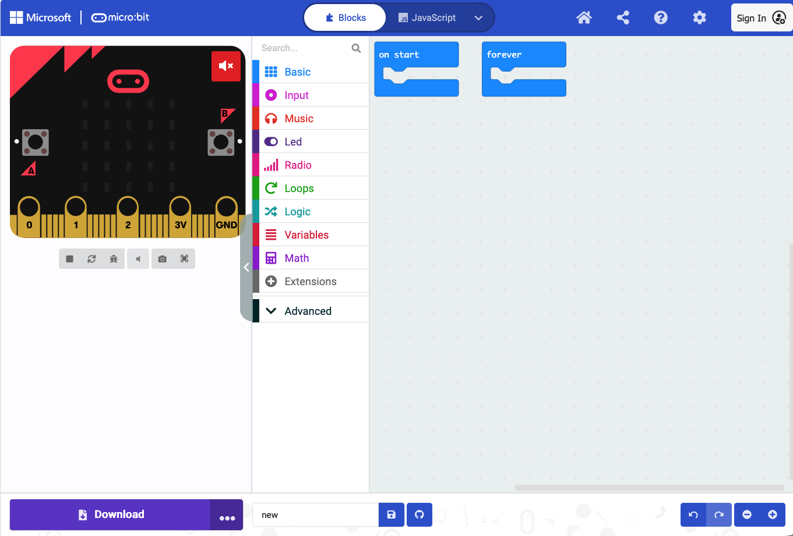

::: {.callout-note}
This is a pre-course lecture. Watch the recorded video, then complete the **Lecture 2 quiz on Canvas** before the course starts.
:::

---

## Learning objectives

By the end of this lecture you should be able to:

- Explain what a program is
- Navigate the MakeCode block editor
- Describe the difference between `on start` and `forever`
- Use variables, conditionals, loops, and functions in MakeCode
- Explain how code gets from your browser onto the micro:bit

---

## 1. What is a program?

A program is a set of instructions, written in a language a machine can follow, that tells it exactly what to do — in what order, under what conditions, and how many times.

Consider a clinical protocol for managing a febrile patient:

1. Measure temperature
2. If temperature is above 38.5°C, administer paracetamol
3. Wait 30 minutes
4. Measure temperature again
5. If still above 38.5°C, escalate to the doctor
6. Repeat every hour

This is already a program. It has measurements, decisions, waiting, and repetition. Programming a microcontroller is the same kind of thinking — you are writing a protocol for a machine to follow.

The difference is that a machine follows instructions with complete literalness. It does exactly what you write, nothing more, nothing less. If your instructions are ambiguous or out of order, it will fail silently or behave unexpectedly. Precision matters.

---

## 2. MakeCode

MakeCode is a browser-based programming environment for the BBC micro:bit, developed by Microsoft. You do not need to install anything — it runs at [makecode.microbit.org](https://makecode.microbit.org).

MakeCode uses **blocks**: coloured, puzzle-piece shaped instructions that you drag and snap together. This removes the need to type code manually, which reduces errors and lets you focus on logic rather than syntax.

The interface has three panels:

- **Left — simulator:** a virtual micro:bit that runs your program in the browser, so you can test without hardware
- **Middle — toolbox:** blocks organised by category (Basic, Input, Logic, Loops, Variables, Functions, and more)
- **Right — workspace:** where you drag blocks and build your program



The simulator is useful but limited — it can only simulate the micro:bit's built-in components. External sensors connected via the Sensorbit cannot be simulated; for those, you need the physical device.

You can switch between **Blocks**, **JavaScript**, and **Python** views using the buttons at the top of the screen. The same program looks different in each view, but they all do the same thing.

---

## 3. `on start` and `forever`

When you open MakeCode, two blocks are already on the workspace.

**`on start`** runs its contents once, when the micro:bit powers on or resets. Use it for setup: displaying a startup message, setting initial variable values.

**`forever`** runs its contents in a continuous loop, repeating as long as the micro:bit is powered on. Use it for monitoring: reading sensors, checking conditions, updating a display.

Most programs use both:

```
on start:
    show "Ready"

forever:
    read temperature
    if temperature > 38.5:
        show warning icon
    else:
        show temperature value
    wait 2 seconds
```

The `forever` loop is why your device keeps working without you pressing anything — it is constantly cycling through its instructions, checking and responding.

::: {.callout-note collapse="true"}
## JavaScript equivalent

```javascript
basic.showString("Ready")

basic.forever(function () {
    let temperature = input.temperature()
    if (temperature > 38.5) {
        basic.showIcon(IconNames.Target)
    } else {
        basic.showNumber(temperature)
    }
    basic.pause(2000)
})
```
:::

---

## 4. Variables

A **variable** is a named container for a value that can change.

Think of it as a labelled box. You put a number, a piece of text, or a true/false value into the box, give the box a name, and refer to it by that name later in your program.

```
set temperature to 0

forever:
    set temperature to [read temperature sensor]
    show temperature on display
```

Variables are essential because they let your program work with values it does not know in advance — like a sensor reading that changes every second.

**Variable types you will use:**

- **Number** — any numeric value (37.2, 0, -5)
- **String** — text ("Ready", "Warning", "Team A")
- **Boolean** — true or false only, used for on/off states and conditions

::: {.callout-note collapse="true"}
## JavaScript equivalent

```javascript
let temperature = 0

basic.forever(function () {
    temperature = input.temperature()
    basic.showNumber(temperature)
})
```
:::

---

## 5. Conditionals

A **conditional** lets your program make a decision: do one thing if a condition is true, do something else if it is not.

```
if temperature > 39.5:
    show "CRITICAL"
else if temperature > 38.5:
    show "FEVER"
else:
    show "NORMAL"
```

The micro:bit evaluates conditions from top to bottom and runs the first branch that is true. Only one branch runs per evaluation.

**Comparison operators you will use:**

| Operator | Meaning |
|----------|---------|
| `>` | greater than |
| `<` | less than |
| `=` | equal to |
| `≥` | greater than or equal to |
| `≤` | less than or equal to |

::: {.callout-note collapse="true"}
## JavaScript equivalent

```javascript
if (temperature > 39.5) {
    basic.showString("CRITICAL")
} else if (temperature > 38.5) {
    basic.showString("FEVER")
} else {
    basic.showString("NORMAL")
}
```
:::

---

## 6. Loops

A **loop** repeats a block of instructions.

`forever` is one kind of loop. But sometimes you want to repeat something a specific number of times, or only while a condition holds.

**Repeat N times** — runs exactly N times, then stops:

```
repeat 5 times:
    show heart icon
    wait 500 ms
    clear display
    wait 500 ms
```

**While loop** — repeats as long as a condition is true:

```
while temperature > 38.5:
    play alarm sound
    wait 1 second
    read temperature again
```

Loops require care. A loop with a condition that is never false will run forever and freeze your program. Always make sure a loop has a clear exit condition.

::: {.callout-note collapse="true"}
## JavaScript equivalent

```javascript
// Repeat N times
for (let index = 0; index < 5; index++) {
    basic.showIcon(IconNames.Heart)
    basic.pause(500)
    basic.clearScreen()
    basic.pause(500)
}

// While loop
while (temperature > 38.5) {
    music.playTone(880, music.beat(BeatFraction.Whole))
    basic.pause(1000)
    temperature = input.temperature()
}
```
:::

---

## 7. Functions

A **function** is a named block of instructions you can call from anywhere in your program.

If you find yourself writing the same sequence of blocks in multiple places, put it in a function:

```
function showAlert:
    show warning icon
    play high tone
    wait 1 second
    clear display

forever:
    if temperature > 38.5:
        call showAlert
    if motion detected:
        call showAlert
```

Functions make programs shorter, easier to read, and easier to fix — if the alert behaviour needs to change, you update it in one place, not everywhere it appears.

In MakeCode, you create functions in the **Functions** category in the toolbox.

::: {.callout-note collapse="true"}
## JavaScript equivalent

```javascript
function showAlert() {
    basic.showIcon(IconNames.Target)
    music.playTone(880, music.beat(BeatFraction.Whole))
    basic.pause(1000)
    basic.clearScreen()
}

basic.forever(function () {
    if (temperature > 38.5) {
        showAlert()
    }
    if (motionDetected) {
        showAlert()
    }
})
```
:::

---

## 8. Reading a sensor

Reading a sensor means getting a value from a connected input device and storing it in a variable. The pattern is always the same:

```
set [variable name] to [sensor reading block]
```

For the micro:bit's built-in temperature sensor this is straightforward. For external sensors connected via the Sensorbit, you will use extension blocks provided by Elecfreaks — we will look at those specifically in Lecture 3. The principle is identical.

---

## 9. Getting your program onto the micro:bit

1. Connect the micro:bit to your laptop with a USB cable
2. The micro:bit appears as a USB drive called **MICROBIT**
3. In MakeCode, click the **Download** button (bottom left of the workspace)
4. A `.hex` file is saved to your computer
5. Drag or copy the `.hex` file onto the MICROBIT drive
6. The orange LED on the micro:bit flashes while it writes the program
7. When it stops flashing, the program is running

You will do this many times during the lab. It takes about 10 seconds. You cannot permanently break a micro:bit by transferring a bad program — simply download and transfer again.

---

## Summary

- A program is a precise set of instructions for a machine to follow
- MakeCode uses drag-and-drop blocks and runs in the browser at [makecode.microbit.org](https://makecode.microbit.org)
- The interface has a simulator (left), toolbox (middle), and workspace (right)
- `on start` runs once at startup; `forever` runs continuously
- Variables store values that change, like sensor readings
- Conditionals make decisions (`if / else if / else`)
- Loops repeat instructions (`repeat N times`, `while`, `forever`)
- Functions group reusable instructions under a name
- Programs are transferred to the micro:bit as a `.hex` file via USB

---

::: {.callout-tip}
## Ready for the quiz?
Complete the **Lecture 2 quiz on Canvas** before the course starts.
:::
