::: {.callout-note}
This is a pre-course lecture. Watch the recorded video, then complete the **Lecture 3 quiz on Canvas** before the course starts.
:::

---

## Learning objectives

By the end of this lecture you should be able to:

- Explain what the Sensorbit does and how it connects to the micro:bit
- Identify each component in the Elecfreaks Smart Health Kit
- Describe what each sensor measures and what signal type it produces
- Give at least one medical and one agricultural use case for each component
- Describe at least one limitation of each sensor
- Explain how to add the Elecfreaks extension in MakeCode

---

## 1. The Smart Health Kit

The Elecfreaks Smart Health Kit is a collection of sensors and actuators designed to explore health and environmental monitoring with the BBC micro:bit. Although it was designed with health applications in mind, several of its sensors are equally relevant to agriculture.

The kit does **not** include a micro:bit — that is your core controller, and you bring it to the kit.

The kit contains:

- The **Sensorbit** — the interface board
- **DHT11** — temperature and humidity sensor
- **Soil moisture sensor**
- **MQ3 alcohol sensor**
- **Analog UV sensor**
- **PIR sensor**
- **Crash sensor brick**
- **OLED screen**
- **Rainbow LED**
- **180° servo motor**
- **DC motor with fan**

We will go through each of these in this lecture.

::: {layout-ncol=2}
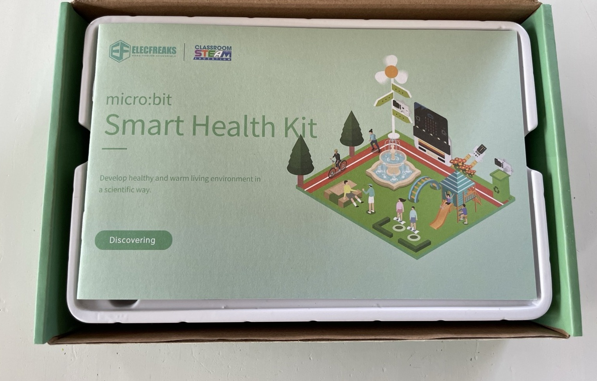

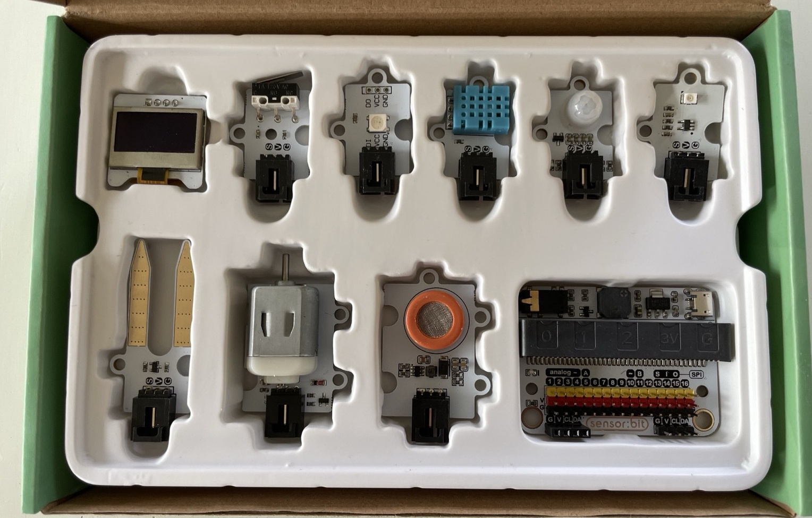
:::

---

## 2. The Sensorbit

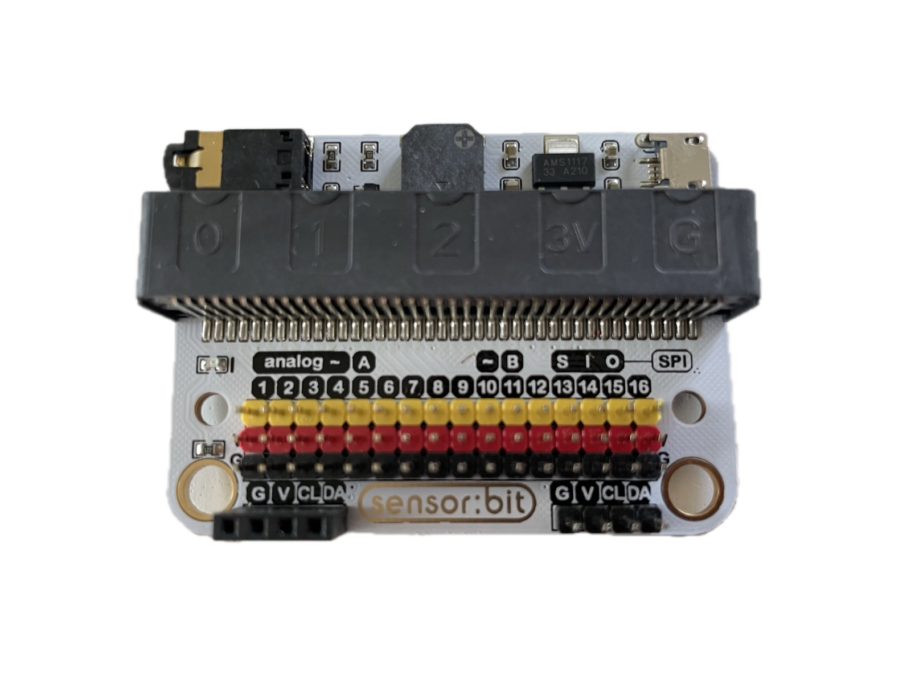{fig-align="center" width="42%"}

The **Sensorbit** is the foundation of the kit. It is a breakout board that plugs onto the micro:bit's edge connector and gives you easy, labelled access to its pins.

Without the Sensorbit, connecting a sensor to the micro:bit would require using crocodile clips or a breadboard to reach the correct pin. The Sensorbit provides clearly labelled ports — P0, P1, P2, and more — with headers that sensors can plug into directly.

It also provides stable **3.3 V power** to the connected sensors, sourced from the micro:bit's own power supply.

**One important point:** when you add sensors that draw significant current — particularly the motor or servo — you may need to power the Sensorbit from an external battery rather than the USB cable alone. USB power is sufficient for most sensors and the OLED, but motors can cause the micro:bit to reset if the current demand spikes.

### Wiring: G, V, and S

Most components in the kit connect to the Sensorbit with a **three-wire cable**. The three wires are not interchangeable — each one has a job:

| Pin | Name | Job | Usual wire colour |
|-----|------|-----|-------------------|
| **G** | Ground | Completes the circuit | Black |
| **V** | Voltage | Supplies 3.3 V power to the sensor | Red |
| **S** | Signal | Carries the measurement to the micro:bit | Yellow (or another colour) |

On the Sensorbit, every numbered port (P0, P1, P2, …) is a column of three pins, and the rows are labelled **G**, **V**, and **S** on the board itself. The sensors carry the same labels next to their pins.

**The rule:** G connects to G, V connects to V, S connects to S — always. A sensor plugged in the wrong way around usually isn't damaged, but it will not work, and a reversed cable is the single most common hardware problem in the lab. **Match the labels printed on the boards, not just the wire colours** — colours are a convention, the labels are the truth.

If a sensor seems dead or gives nonsense readings, check the wiring first: right port, right orientation, connector pushed in fully.

The OLED screen is the exception — it has **four** pins and plugs into the Sensorbit's dedicated **IIC** socket, which is keyed so it only fits one way.

---

## 3. Adding the Elecfreaks extension in MakeCode

The Sensorbit sensors use pin-level communication that the standard MakeCode blocks already support. However, some sensors — particularly the OLED screen — require a dedicated software library.

To add the Elecfreaks extension:

1. Open your project in MakeCode
2. Click **Extensions** at the bottom of the toolbox (middle panel)
3. In the search box, type `smarthome`
4. Select the **smarthome** package from Elecfreaks
5. New block categories will appear in your toolbox

Once installed, blocks for the OLED screen and other kit-specific components will appear in the toolbox alongside the standard blocks.

---

## 4. Environmental sensors

These sensors measure conditions in the surrounding environment.

### DHT11 — Temperature and humidity

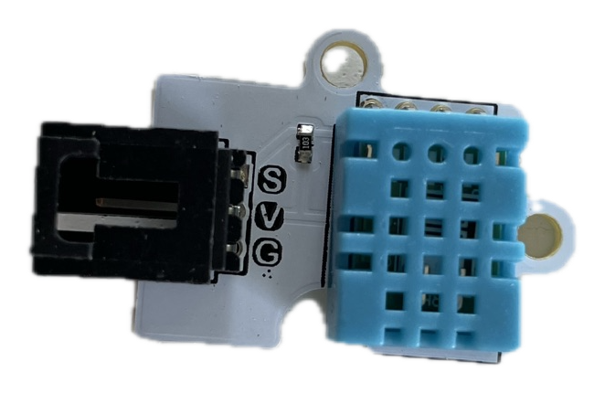{fig-align="center" width="26%"}

The DHT11 measures both **air temperature** (0–50°C, ±2°C accuracy) and **relative humidity** (20–90% RH, ±5% accuracy) in a single, small package. It communicates using a simple digital protocol over a single data wire.

**Medical use:** Monitoring ward temperature and humidity, which affect patient comfort, wound healing, and the growth of pathogens. Tracking cold-chain conditions for vaccines and medications.

**Agricultural use:** Monitoring storage conditions for grain, seed, or fresh produce. High humidity in storage promotes fungal growth; the DHT11 can trigger an alert when conditions become dangerous.

**Limitations:**
- Can only be read once every **two seconds** — reading it faster produces errors
- Accuracy of ±2°C is adequate for environmental monitoring but not for clinical diagnostics
- Range stops at 50°C, which limits use in very hot outdoor environments

---

### Soil moisture sensor

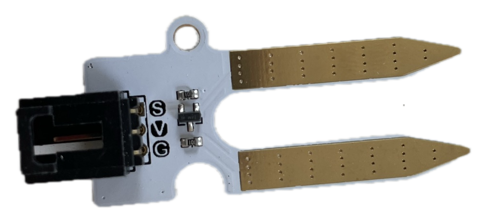{fig-align="center" width="22%"}

The soil moisture sensor consists of two metal probes. It passes a small current through the soil between them and measures resistance. Wet soil conducts electricity better than dry soil, so higher current means more moisture. It produces an **analog signal** — a number that varies continuously with moisture level.

**Medical use:** Limited direct medical application, but useful in agricultural contexts that affect food security and nutrition.

**Agricultural use:** The primary use case. Placed in the root zone of a plant, it can trigger irrigation automatically when the soil dries below a threshold — saving water and preventing crop stress.

**Limitations:**
- The probe tips corrode over time when left in soil, causing readings to drift
- The raw output is a relative value (0–1023 in MakeCode), not a calibrated percentage — you need to test your specific soil type to set meaningful thresholds
- Sensitive to soil salinity: salty soil conducts electricity independently of moisture, giving false high readings

---

### MQ3 — Alcohol sensor

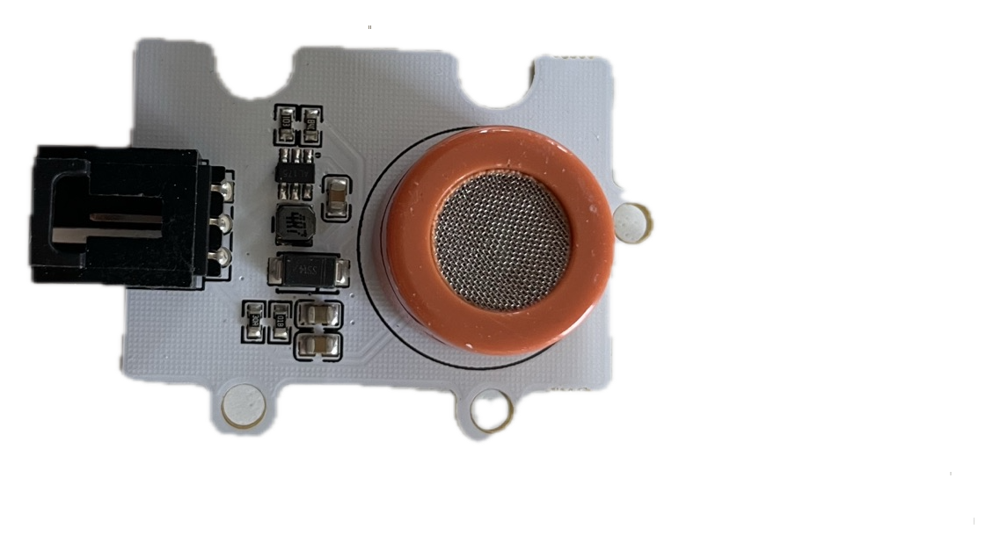{fig-align="center" width="30%"}

The MQ3 detects **alcohol vapour** in the air. It works by measuring a change in electrical resistance in a metal oxide element when alcohol molecules bind to it. It produces an **analog signal**.

**Medical use:** Screening for alcohol consumption (breath testing). Detecting alcohol-based hand sanitiser usage at a clinic entrance.

**Agricultural use:** Monitoring fermentation in biogas digesters or alcohol-based crop processing.

**Limitations:**
- Requires a **warm-up time of approximately 60 seconds** after power-on before readings are reliable — during warm-up, readings are meaningless
- Cross-sensitive: the MQ3 also responds to other volatile compounds, including solvents and cleaning chemicals. It cannot distinguish between ethanol and other alcohols
- Not calibrated — the raw output is a relative signal, not a blood-alcohol percentage. It is suitable for detecting the *presence* of alcohol, not measuring a precise concentration
- The heating element consumes more power than most sensors, which matters in battery-powered designs

::: {.callout-warning}
## The MQ3 gets warm — that is normal
The MQ3 contains a small heating element and becomes noticeably warm to the touch during operation. This is the heater doing its job, not a fault. Don't be alarmed, and don't enclose the sensor in anything that traps heat.
:::

---

### Analog UV sensor

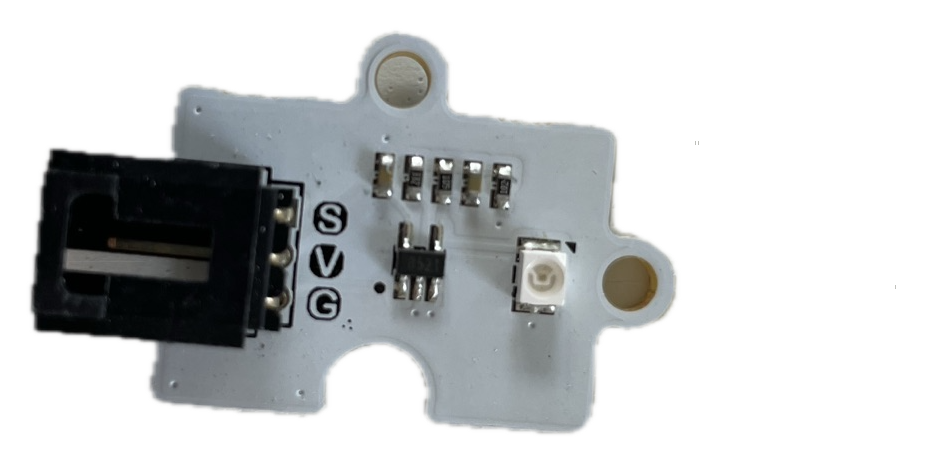{fig-align="center" width="24%"}

The UV sensor measures **ultraviolet light intensity** and produces an **analog signal**. It contains a photodiode sensitive to UV wavelengths (approximately 200–400 nm).

**Medical use:** Monitoring UV exposure for patients with photosensitive conditions. Alerting when outdoor UV levels are high enough to require sun protection.

**Agricultural use:** Measuring light quality for plant growth. UV levels influence secondary metabolite production in some crops. Can be used to optimise greenhouse shading or supplementary lighting.

**Limitations:**
- The raw output requires calibration to convert to a standard UV index
- Sensitive to the angle of the sensor relative to the light source — a sensor lying flat may read differently from one tilted toward the sun
- Does not distinguish between UVA and UVB

---

## 5. Presence and interaction sensors

These sensors detect events or physical interactions rather than measuring continuous quantities.

### PIR sensor — Passive Infrared

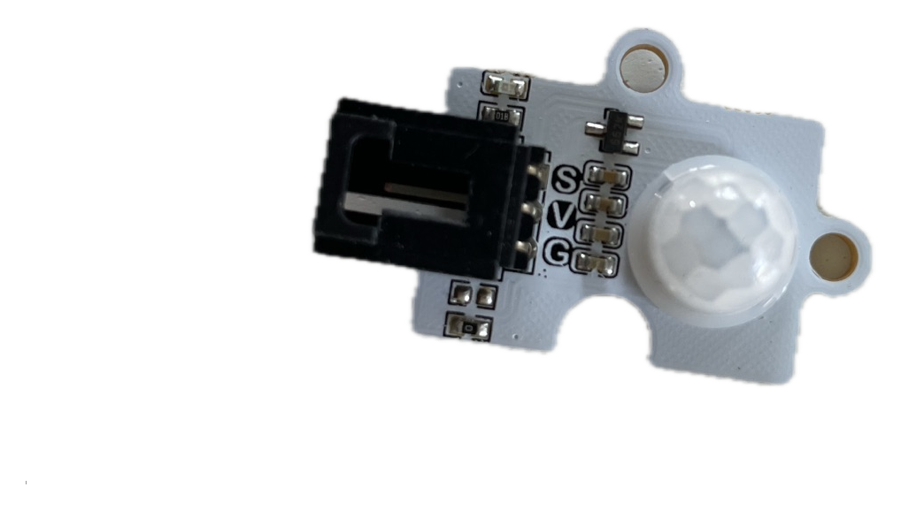{fig-align="center" width="28%"}

The PIR sensor detects **movement of warm bodies** — people, animals, or anything emitting infrared radiation at body temperature. It produces a **digital signal**: 1 (motion detected) or 0 (no motion). It is "passive" because it does not emit anything — it only listens.

**Medical use:** Detecting when a patient enters or leaves a room. Triggering an automated hand sanitiser dispenser. Monitoring patient movement in a ward to detect falls or prolonged inactivity.

**Agricultural use:** Detecting animals entering a protected area. Triggering a deterrent (a sound or light) when livestock or pests approach a crop.

**Limitations:**
- Cannot distinguish between different types of warm bodies — a person and a dog produce similar signals
- Has a detection angle (typically ~120°) and a maximum range (typically ~5–7 m) — placement matters
- Can produce false positives from sudden changes in ambient temperature, such as a breeze through an open window or direct sunlight hitting the sensor

---

### Crash sensor brick

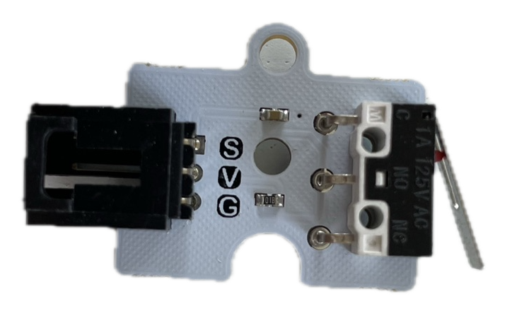{fig-align="center" width="35%"}

The crash sensor is a simple **push button with a lever**, designed to detect physical contact or impact. It produces a **digital signal**: pressed or not pressed.

**Medical use:** Detecting whether a cabinet or drug storage container has been opened. Acting as an emergency call button. Confirming that a patient has performed a physical action (pressed a button to indicate they are present).

**Agricultural use:** Detecting whether a gate or hatch is open or closed. Triggering an action when an animal pushes against a sensor.

**Limitations:**
- Requires direct physical contact — it cannot detect proximity
- The lever can be damaged by repeated heavy impact
- Produces a single on/off signal with no information about force or duration

---

## 6. Output components

These components display information or produce effects that a person can see.

### OLED screen

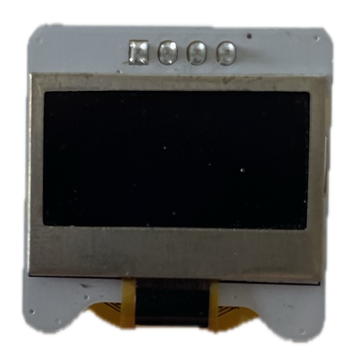{fig-align="center" width="28%"}

The OLED (Organic Light-Emitting Diode) screen is a small display that can show **text and simple graphics**. It connects to the micro:bit via the I²C protocol — a two-wire communication bus — and requires the Elecfreaks extension in MakeCode to use.

Unlike the micro:bit's built-in 5×5 LED matrix, the OLED can display readable text and numbers, making it suitable for showing sensor readings to a user.

**Use cases:** Displaying temperature, humidity, or other sensor readings. Showing status messages ("Alert", "Normal", "Warming up"). Building a simple patient-facing display.

**Limitations:**
- Small physical size limits how much can be displayed at once
- Not visible in direct bright sunlight
- Requires the extension library; it cannot be used with the standard MakeCode blocks alone

---

### Rainbow LED

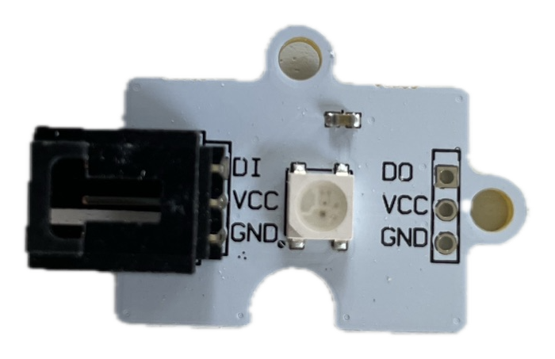{fig-align="center" width="26%"}

The Rainbow LED strip contains multiple individually controllable RGB LEDs. Each LED can be set to any colour by specifying its red, green, and blue components (0–255 each). In MakeCode, these are controlled using the **Neopixel** blocks.

**Use cases:** Colour-coded status indicators (green = normal, yellow = warning, red = alert). Visual feedback during a process. Simple phototherapy prototypes where specific wavelengths are needed.

**Limitations:**
- Draws more current than a single LED — running many LEDs at full brightness simultaneously can strain the micro:bit's power supply
- Not suitable for precise phototherapy — the LEDs are not medically calibrated

---

## 7. Actuators

These components produce physical actions in response to signals from the micro:bit.

### 180° Servo motor

The servo motor rotates to a **specific angle** between 0° and 180°, controlled by a signal from the micro:bit. Unlike a regular motor which spins continuously, the servo holds its position at the angle you specify.

**Medical use:** Opening and closing a valve in a fluid delivery prototype. Pressing a dispenser pump. Controlling a flap or door (e.g., a contactless waste bin lid).

**Agricultural use:** Operating an irrigation valve. Controlling ventilation in a greenhouse. Triggering a trap or gate.

**Limitations:**
- Moves to a position, not a continuous rotation — if you need a spinning motor, use the DC motor instead
- Can only exert limited force (torque) — not suitable for heavy mechanical loads
- Draws significant current when under load, which can cause the micro:bit to reset if not powered externally

---

### DC motor with fan

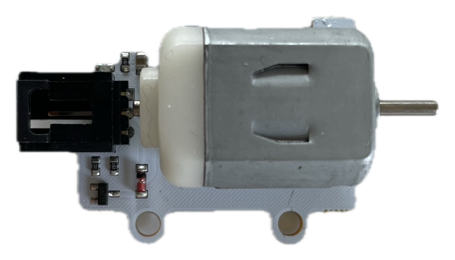{fig-align="center" width="26%"}

The DC motor spins continuously in one direction when powered. In the kit it is attached to a fan blade, making it immediately useful for airflow. It is controlled by an on/off signal (or a variable speed signal) from the micro:bit.

**Medical use:** Ventilation in an enclosed monitoring device. Cooling a prototype that generates heat. Air circulation in a patient room monitor.

**Agricultural use:** Ventilation in a greenhouse or grain storage. Driving a small pump for irrigation.

**Limitations:**
- The fan draws significant current — almost always requires external battery power
- Speed control requires PWM (pulse-width modulation) output from the micro:bit, which is more advanced than simple on/off control
- The motor produces electrical noise that can interfere with sensitive analog sensors — good circuit design keeps motor and sensor wiring separate

---

## 8. Choosing the right component for your use case

Having a kit full of sensors does not mean every sensor is the right tool for every problem. Good engineering requires evaluating components against requirements.

Ask these questions about any sensor you are considering:

| Question | Why it matters |
|----------|---------------|
| Does it measure the right thing? | A soil moisture sensor cannot measure air humidity |
| Is the range appropriate? | The DHT11 stops at 50°C — unsuitable for sterilisation monitoring |
| Is the accuracy good enough? | ±2°C is fine for storage monitoring, not for clinical thermometry |
| How fast does it need to update? | The DHT11's 2-second limit is fine for ambient monitoring, not for a fever alarm |
| Does it need warm-up time? | The MQ3 needs 60 seconds — is that acceptable in your design? |
| How much power does it draw? | Motors and servos need external power in sustained use |
| Will it degrade over time? | The soil moisture sensor corrodes — plan for maintenance |

This kind of systematic evaluation is part of what separates a prototype from a reliable device.

---

## Summary

- The **Sensorbit** connects sensors to the micro:bit and provides labelled, powered ports
- The **Elecfreaks extension** must be added in MakeCode for some components (especially the OLED)
- **Environmental sensors:** DHT11 (temperature + humidity), soil moisture, MQ3 (alcohol), UV
- **Presence sensors:** PIR (motion), crash sensor (contact)
- **Output displays:** OLED screen, Rainbow LED
- **Actuators:** servo motor (angle), DC motor with fan (continuous rotation)
- Every sensor has a range, accuracy limit, timing constraint, and potential failure mode — evaluate before choosing

---

::: {.callout-tip}
## Ready for the quiz?
Complete the **Lecture 3 quiz on Canvas** before the course starts on 16 June.
:::
